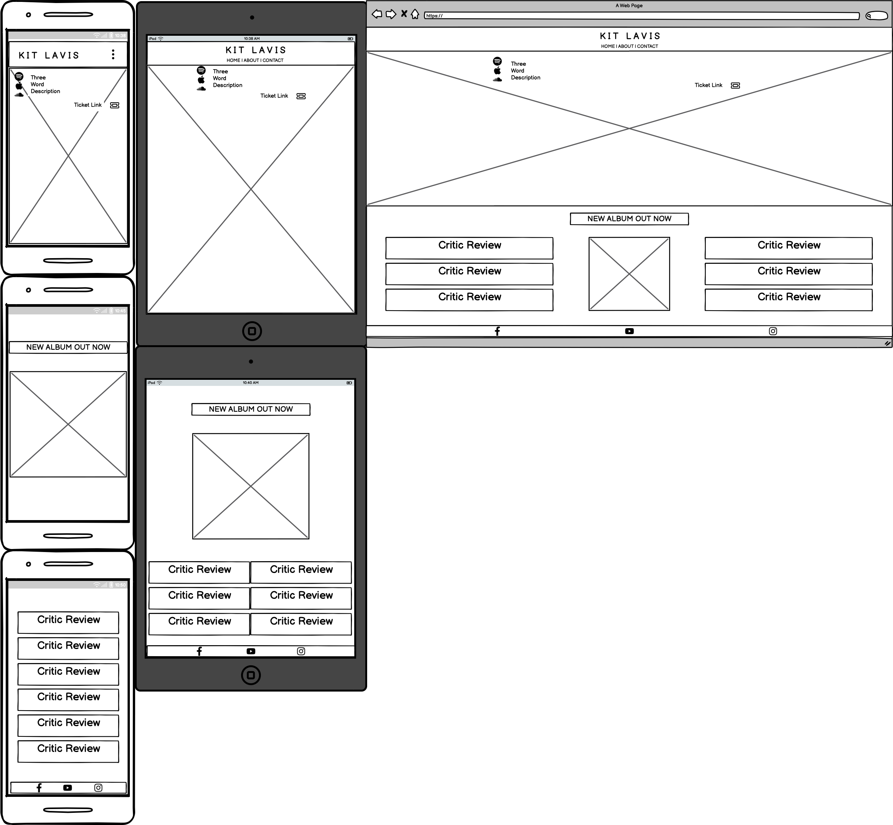
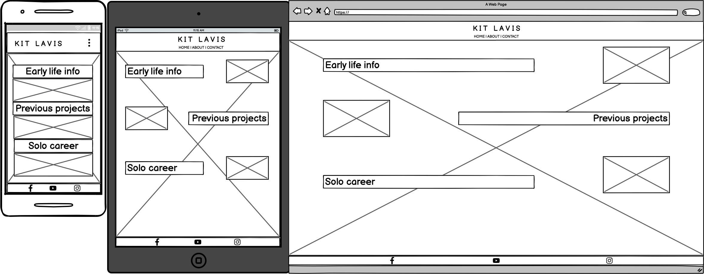
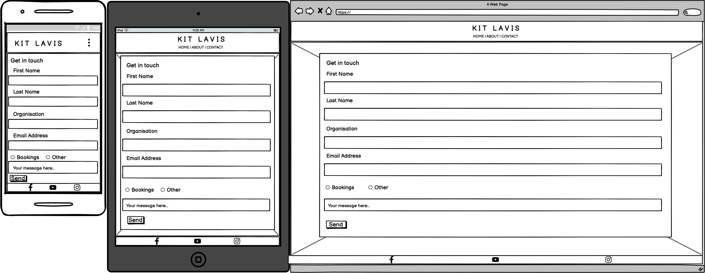
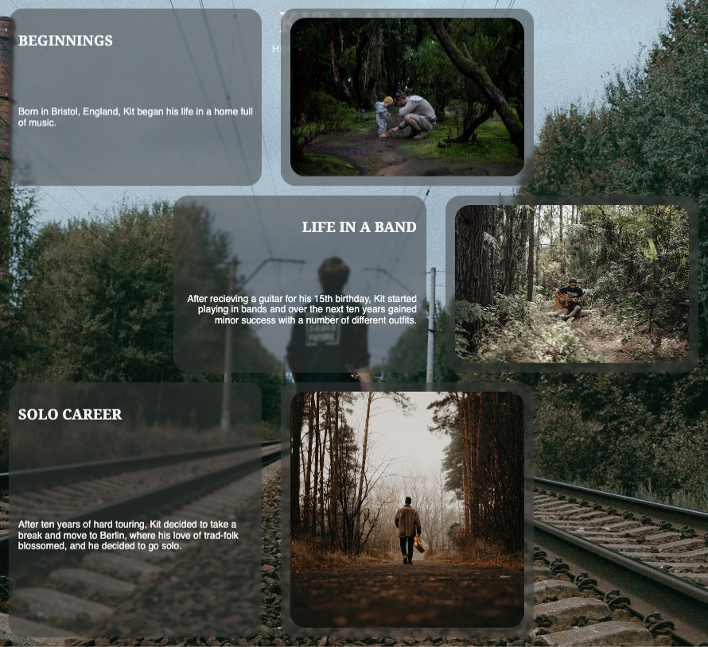
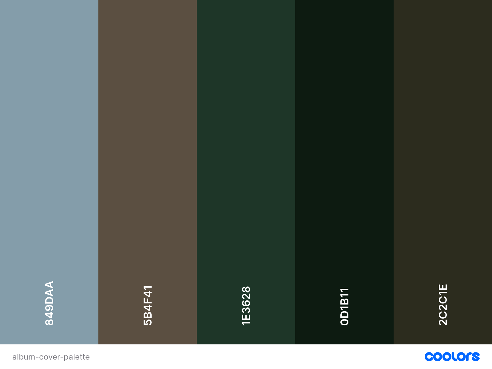

# Kit Lavis

This project is a site created to promote the new album by fictional English folk guitarist Kit Lavis. The website is targeted mainly towards exisiting fans, however the imagery and design has been tailored in order to intice fans of the genre, who may not already be familarised with his music.

[Live Deployment](https://kitlavis.github.io/kit-lavis-folk-guitarist/)

## Planning

During the planning phase of the project, a number of questions were adressed in order to identify who the project is for, why the project is necessary/the aims of the project, and how those aims will be met.

- Who is the project for?
  - The project is for exisiting fans of the artist, and potential new fans, who are already familiar with the genre.
- The aims of the project:
  - To provide a base to access information about the artist and their output.
  - To promote the new album.
  - To provide a place where people in the industry and fans can contact the artist.
- How will the aims be met?
  - Potential new fans will be inticed by using design that will feel familiar for fans of the genre.
  - Information about the artist will be provided in clear concise text, with appropriate images to match said information.
  - Links to the artist's output on the most popular streaming platforms will be included on the landing page.
  - Thew new album will be presented as the basis across the whole site, with a dedicated section on the landing page including a brief description and a link purchase the album.
  - A dedicated contact page with a clear and easy to use form will be created.

### Wireframing

With this information gathered, wireframes were then created to gain a basic visual representation of the project across a number of device sizes.

Landing page

About page

Contact page

## Features

### Existing Features

- Navigation Bar
  - This is a fully responsive feature allowing the user to navigate easily between all three pages of the website without the need to use the 'back' button.
  - On mobile devices the page names are hidden behind a clickable 'three dots icon' to allow for slightly more breathing space on the smaller screen, whilst on a tablet sized device or larger, the page names are placed in the centre of the viewport, beneath the title of the web page.

- Landing page
  - The image chosen for the landing page is the cover of the new album that is being promoted in order to instantly familarise the user with said image. This is overlaid with links to the most popular streaming platforms and a brief description of the artist for potential new fans.

- Album Advert
  - The advert section allows the user to purchase the album, drawing their attention to the new album with emphasised text and repeat use of the album cover, which should now be a familiar image.

- Footer
  - The footer is a feature that remains consitent in style and function across all device sizes. It provides links in the form of icons which allow the user to access the three main websites used by the artist as their online presence in 2023; Facbbook, Instagram and Youtube.

- About Page
  - The about page consists of small blocks of text providing information about the artist to allow the user to relate to the artist further, hopefully solidifying the view of exisiting fans and helping potential new fans gain an idea of who the artist is. So that the page isn't too text heavy, an image is placed next to each body of text.

- Contact Form
  - The contact form allows for a message to be sent to the artist. The main use of this feature is for promoters/booking agents to contact regarding availabilities, however it may also be used by fans to send a message directly to the artist.

### Features for Future Development

Due to project requirements and time restrictions, a number of features were not included.
- Dedicated Media Page
  - A page souly for media will be added in future. This will include embedded audio and video, allowing the user to access the artist's music without having to open an external link.
- Dedicated Events Page
  - Similar to the media page, in future a page will be added with upcoming tour dates and links to purchase tickets for the events.

### Development

Due to design consistentcy, future development of the project is extremely simple.
- The background for all pages can be altered by changing one single image. This could be the latest release from the artist, or an image from the latest photoshoot.
- The advert on the landing page can also be easily updated to the latest output from the artist.
- When creating the dedicated media and events pages, the basic HTML that is used across all three existing pages can be pasted into the new pages in order to create the basis to work from.
- All sections within the stylesheet are labelled with clear comments describing what the following CSS does. This allows developers that may have never seen the code before to edit and update the code with ease.

## Design Notes

### General

- The album cover image is used as the basis of every page of the project in order to keep the design consistent, and so that the image becomes familiar to the user and sticks in their mind.
- Although it is generally accepted that sans-serif font families are better suited for uses on the web, Noto serif was used as the main font for headers. This is because it looks rather 'old-timey' which compliments the artist and their music.

### Colour

- As the majority of the content is laid on top of the album image, the colour had to be chosen carefully with UX design in mind in order for the user to easily read any information presented to them. Therefore the colour 'whitesmoke' was chosen for any text or icon that overlays the album image.
- As the colours within the album image itself are rather subdued, the footer colour and the background-colour for the review section had to match this theme. Therefore the shade of grey with a hex value of #3a3a3a was used so that the user isn't suddenly overwhelmed with a wash of colour, and the feel of the site remains consistent throughout.
- A number of other shades of grey were used throughout the project, which can be seen in the colour palette below.

## Technologies

- The basic content of the project was created using HTML.
- This content was then styled using CSS.
- Codeanywhere was the IDE utilised for the project.
- The Git repository was stored on GitHub.

## Testing

### Validator Testing

- The HTML was validated using the W3C validator. No errors and no warnings were reported. A link to the result can be found [here](https://validator.w3.org/nu/?doc=https%3A%2F%2Fkitlavis.github.io%2Fkit-lavis-folk-guitarist%2F)
- The CSS was validated using the W3C CSS validator. No errors were found and one warning regarding imported style sheets was reported. A link to the result can be found [here](http://jigsaw.w3.org/css-validator/validator?lang=en&profile=css3svg&uri=https%3A%2F%2Fkitlavis.github.io%2Fkit-lavis-folk-guitarist%2F&usermedium=all&vextwarning=&warning=1)

### Manual Debugging

The project was deployed at an early stage to allow for continutal manual debugging throughout the process. The deployment link was shared to four potential users who routinely checked a list of potential areas where issues can easily arise. This list included, but was not limited to:
- Links (internal and external)
- Navigation bar responsiveness
- Responsiveness of content areas
- Contact form function

## Deployment

The project was deployed via GitHub Pages. To do this, the following process was followed:
- While in the GitHub repository, click the settings icon in the nav bar.
- Select the Main Branch from the source section drop-down menu and click save.
- Once succesfully deployed, the deployment can be accessed from the Deployment Section in the right-hand column of the code page of the GitHub repository.

Live deployment link - [deployment](https://kitlavis.github.io/kit-lavis-folk-guitarist/)

## Credits

### Media and Design

- All photographs used were taken from stock image provider [pexels.com](https://www.pexels.com)
- The favicon was created using [favicon.io](https://www.favicon.io)
- Colour palette was created using [coolors.co](https://coolors.co/)
- Fonts were provided by [Google Fonts](https://fonts.google.com/)
- All icons were provided by [Font Awesome](https://fontawesome.com/icons)
- Wireframes were created using [Balsamiq](https://balsamiq.com/)

### Code

- The code for the clickable three dot icon on the navigation bar was taken from the Code Institute's Love Running walkthrough project.
- The contact form is based off of the 'sign up form' also from the Code Institute's Love Running walkthrough project.
  - [Love Running GitHub Repo](https://github.com/Code-Institute-Solutions/love-running-2.0-sourcecode)
